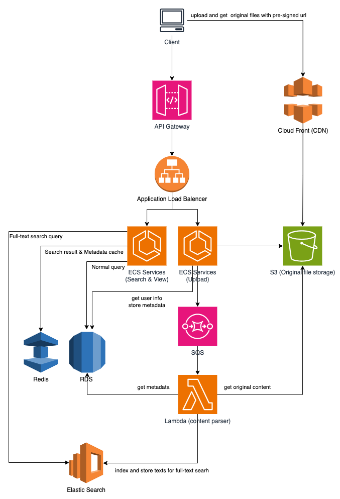

## Distributed Dictionary System Design

### Basic Requirements
* User can upload texts or books
* User can view the texts or books
* User should be able to search texts or books

### Solution

**User upload flow**
1. The client sends GET /pre-signed-url request and uploads original files.
2. The client sends POST /texts or POST /books request.
3. Upload service validate metadata and uploaded files.
4. Upload service store metadata to DB and enqueue for content parser.
5. Content parser get files from S3 and metadata from DB then stores texts to Elastic Search.

**User view flow**
1. The client sends GET /texts, GET /books  or GET /texts/<:id>, GET /books/<:id> request.
2. View & Search service get metadata from DB and generate pre-signed url to accsee files (cached by CDN).

**User search flow**
1. The client sends GET /search?q=word request.
2. View & Search service search contents from Elastic Search and get metadata from DB.